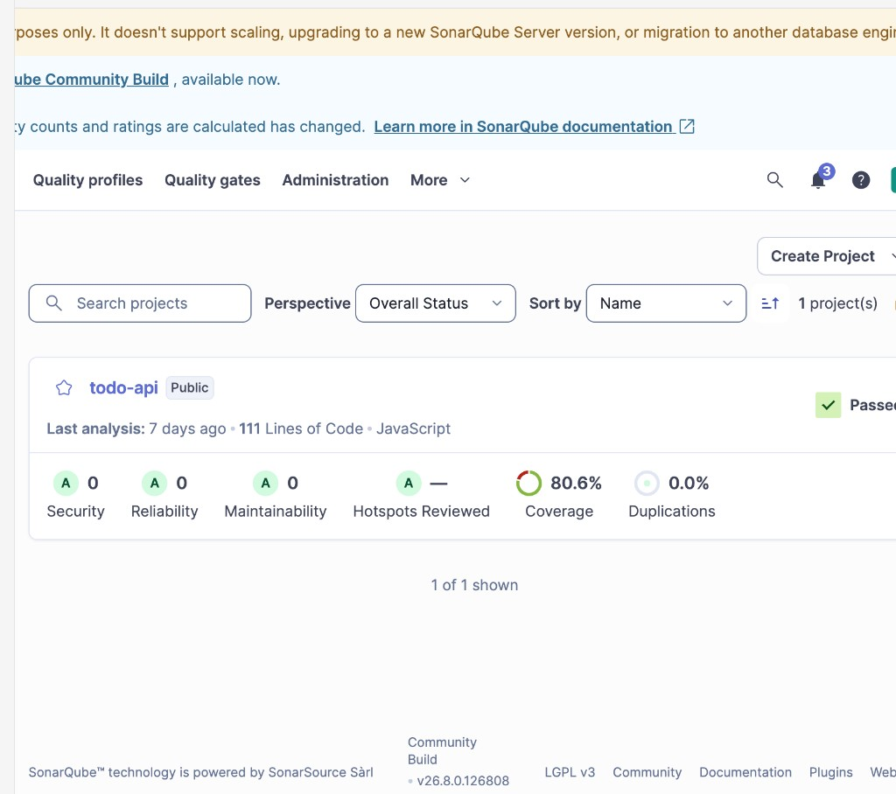
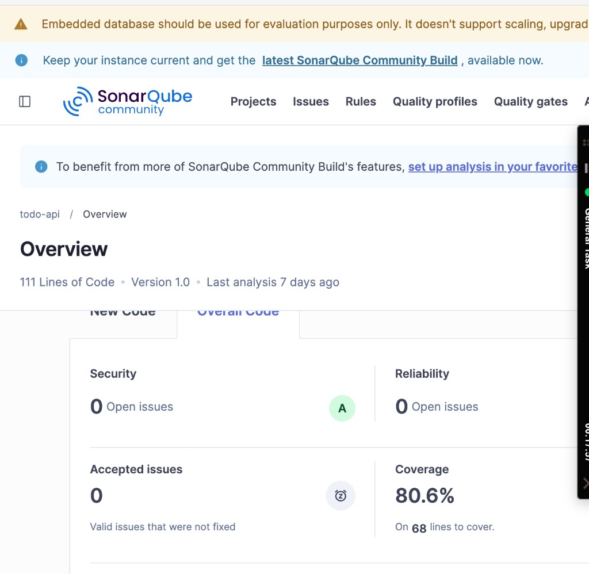
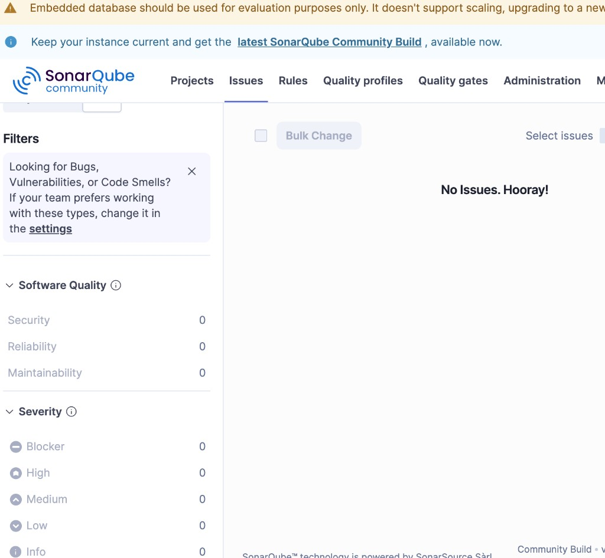

# Evidencia SonarQube — todo-api

Tarea 4 (Trivy, Sonar, Docker). La consigna pide captura o enlace del análisis con el **nombre del proyecto** y el resultado.

- Proyecto / project key: **todo-api**
- Entorno: SonarQube Community Build **26.8.0.126808** (local, no SonarCloud)
- Fecha del análisis: 2026-09-01
- Scanner: `sonarsource/sonar-scanner-cli` 8.0.1
- Dashboard (cuando Sonar está arriba): `http://127.0.0.1:9000/dashboard?id=todo-api`

## Capturas (2026-09-08)

Lista de proyectos: **todo-api**, JavaScript, 111 ncloc, Quality Gate **Passed**, ratings A:



Overview del proyecto **todo-api** (111 ncloc, versión 1.0, Security A, Reliability 0 issues, Coverage 80.6%):



Pestaña Issues: **No Issues. Hooray!** (Security 0, Reliability 0, Maintainability 0):



Consulta `GET /api/measures/component?component=todo-api&metricKeys=bugs,vulnerabilities,code_smells,coverage,ncloc,security_hotspots`:

```json
{
  "component": {
    "key": "todo-api",
    "name": "todo-api",
    "qualifier": "TRK",
    "measures": [
      { "metric": "coverage", "value": "80.6" },
      { "metric": "bugs", "value": "0" },
      { "metric": "code_smells", "value": "0" },
      { "metric": "ncloc", "value": "111" },
      { "metric": "vulnerabilities", "value": "0" },
      { "metric": "security_hotspots", "value": "0" }
    ]
  }
}
```

Consulta `GET /api/issues/search?componentKeys=todo-api`: `"total": 0`, `"issues": []`.  
Hotspots: 0.

Interpretación: el Quality Profile "Sonar way" no reportó bugs, vulnerabilidades ni code smells. No se modificó el código de la API para inventar correcciones.
